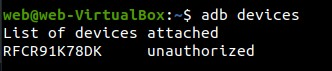
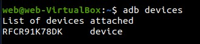
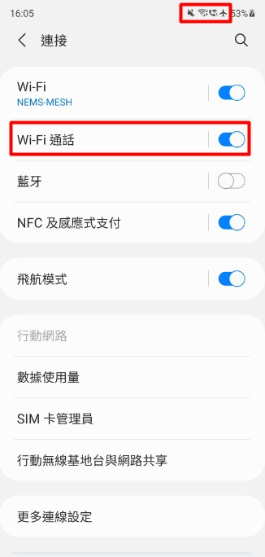

# Cell ID Tracker

## 1. Environment Setup

### 1.1 Install Dependency

If you want to run on your phone. You need to install the cross-compile tool.

You also need `cmake` >= 3.24, so you may need to uninstall the original `cmake`

For example
```bash
cd && wget https://dl.google.com/android/repository/android-ndk-r25-linux.zip && unzip android-ndk-r25-linux.zip
```

```bash
sudo apt-get update -y
sudo apt-get install -y software-properties-common lsb-release net-tools iproute2 iputils-ping vim tmux tcpdump git curl openssh-server 
sudo -i
apt-key adv --fetch-keys https://apt.kitware.com/keys/kitware-archive-latest.asc
apt-add-repository "deb https://apt.kitware.com/ubuntu/ $(lsb_release -cs) main"
add-apt-repository ppa:ubuntu-toolchain-r/test 
apt-get update 
apt-get install -y cmake g++-10 
update-alternatives --install /usr/bin/gcc gcc /usr/bin/gcc-10 60 --slave /usr/bin/g++ g++ /usr/bin/g++-10
```

## 2. Build

### 2.1 Adjust Config for Android Toolchain
```bash
cd wifi-calling
cmake -S all -B build -D CMAKE_TOOLCHAIN_FILE=$HOME/android-ndk-r25/build/cmake/android.toolchain.cmake -D ANDROID_PLATFORM=android-O -D CMAKE_BUILD_TYPE=Release

```

### 2.2 Build Binary
```bash
cmake --build build --config Release --parallel
```

## 3. Install
### 3.1 Connect Device
- Open the developer options, and allow the USB debugging
- Use the adb command to check if the device is connected to the computer

```bash
adb devices
```



- Use the adb command to check the authorization
```bash
adb devices
```


### 3.2 Push Binary
```bash
adb push bin/spoof /data/local/tmp
adb push config /data/local/tmp/
```


## 4. Usage
### 4.1 Open VoWiFi

- Note that do not open the VoLTE
- Open the airplane mode




### 4.2 Remote Cell ID Prober

```bash
su
cd /data/local/tmp
echo ${victim_phone_number} > victim_list 
./spoof -r
```


### 4.3 Local Cell ID Prober

```bash
su
cd /data/local/tmp
./spoof -l
```


### 4.4 RL-assisted Remote Cell ID Prober

```bash
su
cd /data/local/tmp
echo ${victim_phone_number} > victim_list 
./spoof -a
```
